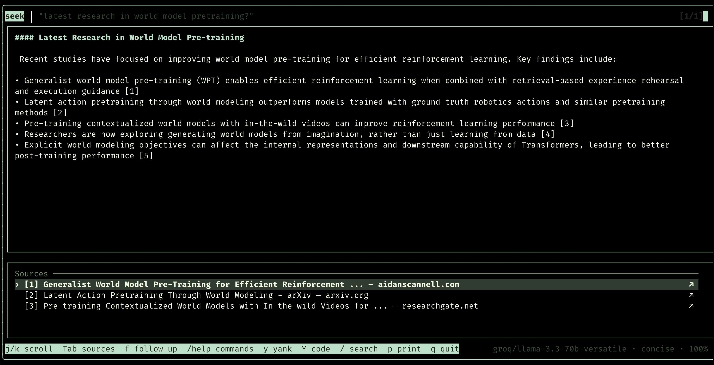

```text
███████╗███████╗███████╗██╗ ██╗
██╔════╝██╔════╝██╔════╝██║ ██╔╝
███████╗█████╗ █████╗ █████╔╝
╚════██║██╔══╝ ██╔══╝ ██╔═██╗
███████║███████╗███████╗██║ ██╗
╚══════╝╚══════╝╚══════╝╚═╝ ╚═╝
```

AI-powered web search from your terminal. Fast, keyboard-driven, and lightweight.

`seek` is for the moment when you're coding, need a grounded answer, and don't want to leave the terminal. It uses Tavily for quick web search and either Ollama or an OpenAI-compatible backend to generate summaries to answer your question.



## Install

```bash
curl -fsSL https://vishruthb.github.io/seek/install.sh | sh
```

That installs the binary to `~/.local/bin/seek`.

If you're working from source instead:

```bash
go build -o ~/.local/bin/seek .
```

If `seek` is not found after install, add this to `~/.bashrc` or `~/.zshrc`:

```bash
export PATH="$HOME/.local/bin:$PATH"
alias s='seek'
```

Reload your shell:

```bash
source ~/.bashrc
```

## Setup

Run the guided setup wizard:

```bash
seek --setup
```

That writes `~/.config/seek/config.toml` and prints the exact path when it's done. You can check it anytime with:

```bash
seek --config
```

You need:

1. A Tavily API key for search
2. One answer backend
   `ollama` locally, or `openai` for Groq / OpenRouter / Together / OpenAI-compatible APIs

### Option A: Ollama

```bash
ollama serve
ollama pull llama3.1:8b
```

### Option B: Groq

You can also keep secrets in env vars instead of the config file:

```bash
export TAVILY_API_KEY="tvly-..."
export OPENAI_API_KEY="gsk-..."
export OPENAI_BASE_URL="https://api.groq.com/openai"
export SEEK_OPENAI_MODEL="llama-3.3-70b-versatile"
```

Env vars override `config.toml`.

## Usage

```bash
seek "what is a transformer in ML?"
seek --format learning "how does QUIC differ from TCP?"
seek --backend ollama "compare goroutines and threads"
seek
```

When launched with plain `seek`, the input window opens immediately.

### In-session slash commands

Use `/` in the input bar to reconfigure the current session without restarting:

```text
/backend openai
/backend ollama
/mode concise
/mode learning
/format explanatory
/model llama-3.3-70b-versatile
/depth advanced
/results 8
/copy
/show
/help
/exit
```

## Core keys

| Key | Action |
| --- | --- |
| `j` / `k` | Scroll |
| `Tab` | Switch between answer and sources |
| `f` | Open follow-up input |
| `/` | Search within the answer |
| `y` | Copy the full answer |
| `Y` | Copy a fenced code block |
| `o` | Open the selected source |
| `q` | Quit |

`seek` is intentionally small. One binary, no browser UI, no background services.
